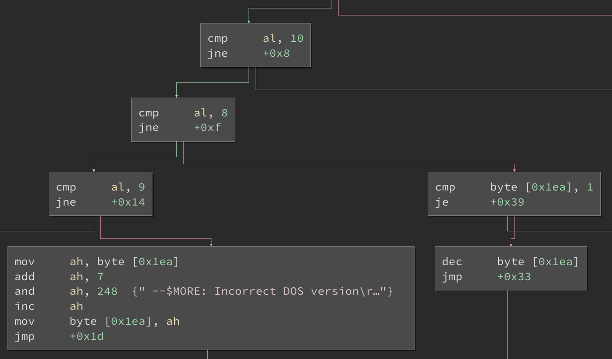

# Binary Ninja Intel 8086 plugin

The Intel 8086 plugin provides a 16-bit x86 architecture for Binary Ninja.

## Features

This plugin decodes and lifts all original 8086 instructions. However, 80186 (and more recent) instructions such as `enter` and `leave` are not recognized. Non-well-formed instructions (including unrecognized opcodes and invalid addressing modes) are displayed as `unrecognized` and rejected during lifting.

The `pascal` and `cdecl` calling conventions are provided.

## License

[0-clause BSD](LICENSE-0BSD.txt)
